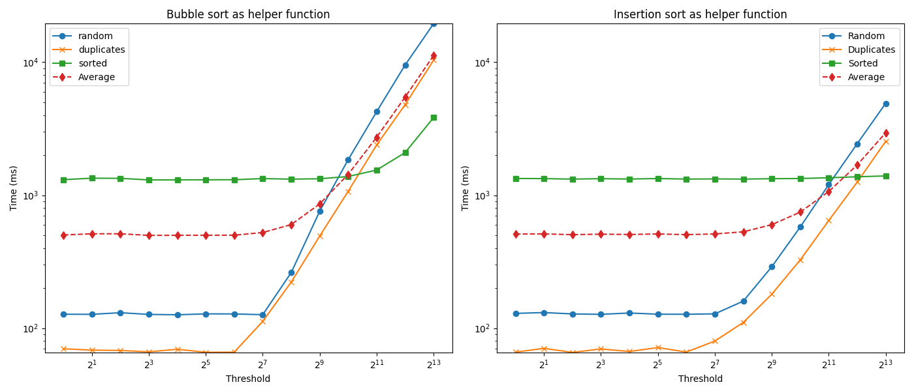

# Øving 3: Algoritmer og Datastrukturer (Alternativ 1)

## Innhold

- [Oppgavebeskrivelse](#oppgavebeskrivelse)
- [Algoritmen](#algoritmen)
- [Tidskompleksitet](#tidskompleksitet)
- [Tidsmålinger](#tidsmålinger)
- [Grafisk fremstilling av målingene](#grafisk-fremstilling-av-målingene)
- [Konklusjon](#konklusjon)

---

## Oppgavebeskrivelse

Jeg velger å løse oppgave alternativ 1. Oppgaven er en forskningsoppgave og handler om å utvikle en rask sorteringsalgoritme. Hver oppgave må møte noen generelle krav:

1. Deloppgaven er løst, med de krav som er i den. Så sjekk oppgavens egne krav.
2. Kildekode og måleresultater er med.
3. Programmet sorterer korrekt, og passerer disse testene:
   a) tabell[i] >= tabell[i-1] for alle i fra 1 til tabell.length-1. En slik test avslører feil sortering.
   b) Sjekksum på tabellen er den samme før og etter sortering. Sjekksummen er summen av alle tallene i tabellen. Denne testen oppdager feil hvor tall blir overskrevet.
   Hvis ikke disse testene gjøres på hver eneste sortering, underkjennes oppga- ven.
4. Programmet må kunne sortere en million tall på rimelig tid. (Om noen bruker python eller andre interpreterte språk, er det nok med 100 000 tall.)
5. Programmet må kunne sortere en million tall med mange duplikater, på rimelig tid. En tabell med duplikater lages slik at annenhvert tall er tilfeldig, og annenhvert tall er tallet 42. (For python holder det med 100 000 tall.) På nett og i noen andre lærebøker fins dessverre eksempler som ikke klarer dette.
6. Etter en sortering, skal programmet deretter sortere den sorterte tabellen på nytt, uten å få problemer. Altså ingen 𝑛2-problemer med sorterte tabeller. Hvis det tar over dobbel tid å sortere en allerede sortert tabell, er oppgaven underkjent! (Vari- anter med dårlig valg av pivot, får dette problemet.)

Jeg begynner med å utvilke en algoritme som møter de generelle godskjenningskravene. Deretter utvikler jeg en algoritme som møter kravene for deloppgaven:

1. Lag en variant av quicksort hvor rekursjonen brytes når deltabellen kommer under en «passende» størrelse. Når dette skjer skal quicksort-metoden benytte en annen sortering som hjelpealgoritme i stedet. Hjelpealgoritmen kan være en enklere sor- tering, som innsettingssortering, boblesortering, velgesortering eller shellsort. Det blir mer spennnende hvis ikke alle gruppene bruker samme hjelpealgoritme.
2. Finn ut hvor stor den «passende» størrelsen er ved å kjøre tester med tidtaking på store datamengder. Finn altså hvilken størrelse som gir raskest sortering for en gitt stor datamengde. Hvis svaret på dette blir 1 eller ∞ har dere gjort feil et sted. Ulike implementasjoner har ulik hastighet, så det kan godt hende at en gruppe får 35 mens en annen gruppe får 2 300 som passende størrelse for å bryte rekursjonen.
3. Måleserie (gjerne med kurve) som viser hvordan dere fant passende størrelse for å bytte til hjelpealgoritmen
4. Tidtaking både for quicksort med hjelpealgoritme, og quicsort uten. Noe bedre tid med hjelpealgoritmen. (En god implementasjon vil alltid hjelpe – det interessante her er hvor mye.)
5. Felleskravene er også oppfylt.

---

## Algoritmen

Jeg løser først for de generelle kravene. De generelle kravene 4, 5 og 6 kommer med hver sin utfordring. Krav 4, altså løse for en million tall innenfor rimelig tid kan løses med en vanlig quicksort algoritme fordi denne har tidskompleksitet $\Omega(n\cdot log(n))$.

Krav 6, altså å kunne sortere en allerede sortert tabell på nytt uten å få problemer kan løses ved å velge en pivot som er medianen av 3 tall, det første, midterste, og siste. Dette gjør at quicksort ikke får problemer med å sortere en allerede sortert tabell.

Krav 5 kan løses med en annen implementasjon av quickSort kalt "Dutch National Flag" eller "3-way QuickSort". Den deler tabellen inn i tre deler, en del med tall som er mindre enn pivot, en del med tall som er større enn pivot og en del med tall som er lik pivot. Denne algoritmen er betydelig raskere til å sortere tabeller med mange duplikater enn vanlig quicksort.

`main.cpp`:

```cpp

#include <algorithm>
#include <chrono>
#include <iomanip>
#include <iostream>
#include <string>
#include <vector>

using namespace std;

using sort_function = void (*)(vector<int> &, int, int);

void runThresholdTestsOnAlgorithm(sort_function sortFunction, int n);

void quickSortMedian(vector<int> &vec, int low, int high);
void quickSort3Way(vector<int> &vec, int low, int high);
void quickSort3WayBubbleHelper(vector<int> &vec, int low, int high);
void quickSort3WayInsertionHelper(vector<int> &vec, int low, int high);

int threshold = 10;

int main() {
 srand(time(NULL));

 // vector<int> N = {100, 1000, 10000, 100000, 1000000};
 static int n = 1000000;

 cout << "Oving 3" << endl
      << endl;

 // runThresholdTestsOnAlgorithm(quickSortMedian, n);

 // cout << endl;

 // runThresholdTestsOnAlgorithm(quickSort3Way, n);

 cout << "\n\nbubbleThreshold = " << threshold << " for bobblesortering:" << endl
      << endl;

 runThresholdTestsOnAlgorithm(quickSort3WayBubbleHelper, n);

 cout << "\ninsertionThreshold = " << threshold << " for insettingssortering:" << endl
      << endl;

 runThresholdTestsOnAlgorithm(quickSort3WayInsertionHelper, n);

 return 0;
}

struct SortTest {
 vector<int> data;
 int checkSum;

 SortTest(vector<int> data, int checkSum) : data(data), checkSum(checkSum) {}
};

SortTest generateRandomSortTest(int n) {
 vector<int> vec(n);

 int range = 10000;

 int sum = 0;
 for (int i = 0; i < n; i++) {
     vec[i] = rand() % range - range / 2;
     sum += vec[i];
 }

 return SortTest(vec, sum);
}

SortTest generateDupeSortTest(int n) {
 vector<int> vec(n);

 int range = 10000;

 int sum = 0;
 for (int i = 0; i < n; i++) {
     switch (i & 1) {
     case 0:
         vec[i] = 42;
         break;
     case 1:
         vec[i] = rand() % range - range / 2;
         break;
     }
     sum += vec[i];
 }

 return SortTest(vec, sum);
}

SortTest generateSortedSortTest(int n) {
 vector<int> vec(n);

 int sum = 0;
 for (int i = 0; i < n; i++) {
     vec[i] = i - n / 2;
     sum += vec[i];
 }

 return SortTest(vec, sum);
}

bool isSorted(SortTest sortTest) {
 vector<int> &vec = sortTest.data;
 int sum = 0;
 for (size_t i = 0; i < vec.size(); i++) {
     if (i < vec.size() - 1 && vec[i] > vec[i + 1])
         return false;

     sum += vec[i];
 }

 return sum == sortTest.checkSum;
}

int medianOfThree(vector<int> &vec, int low, int high) {
 int mid = low + (high - low) / 2;
 if (vec[low] > vec[high])
     swap(vec[low], vec[high]);
 if (vec[low] > vec[mid])
     swap(vec[low], vec[mid]);
 if (vec[mid] > vec[high])
     swap(vec[mid], vec[high]);

 return mid;
}

int partition(vector<int> &vec, int low, int high) {
 int pivotIndex = medianOfThree(vec, low, high);
 swap(vec[pivotIndex], vec[high]);
 int pivot = vec[high];

 int i = low;
 for (int j = low; j <= high - 1; j++) {
     if (vec[j] < pivot) {
         swap(vec[i], vec[j]);
         i++;
     }
 }

 swap(vec[i], vec[high]);
 return i;
}

void threeWayPartition(vector<int> &vec, int low, int high, int &lt, int &gt) {
 int pivotIndex = medianOfThree(vec, low, high);
 swap(vec[pivotIndex], vec[high]);
 int pivot = vec[high];

 lt = low;
 gt = high;
 int i = low;

 while (i <= gt) {
     if (vec[i] < pivot) {
         swap(vec[lt++], vec[i++]);
     } else if (vec[i] > pivot) {
         swap(vec[i], vec[gt--]);
     } else {
         i++;
     }
 }
}

void bubbleSort(vector<int> &vec, int low, int high) {
 bool swapped;
 for (int i = low; i <= high; i++) {
     swapped = false;
     for (int j = low; j < high - i + low; j++)
         if (vec[j] > vec[j + 1]) {
             swap(vec[j], vec[j + 1]);
             swapped = true;
         }

     if (!swapped)
         break;
 }
}

void insertionSort(vector<int> &vec, int low, int high) {
 for (int i = low + 1; i <= high; i++) {
     int key = vec[i];
     int j = i - 1;

     while (j >= low && vec[j] > key) {
         vec[j + 1] = vec[j];
         j--;
     }
     vec[j + 1] = key;
 }
}

void quickSortMedian(vector<int> &vec, int low, int high) {
 if (low >= high)
     return;

 int pi = partition(vec, low, high);
 quickSortMedian(vec, low, pi - 1);
 quickSortMedian(vec, pi + 1, high);
}

void quickSort3Way(vector<int> &vec, int low, int high) {
 if (low >= high)
     return;

 int lt, gt;
 threeWayPartition(vec, low, high, lt, gt);
 quickSort3Way(vec, low, lt - 1);
 quickSort3Way(vec, gt + 1, high);
}

void quickSort3WayBubbleHelper(vector<int> &vec, int low, int high) {
 if (low >= high)
     return;

 if (high - low <= threshold) {
     bubbleSort(vec, low, high);
     return;
 }

 int lt, gt;
 threeWayPartition(vec, low, high, lt, gt);
 quickSort3WayBubbleHelper(vec, low, lt - 1);
 quickSort3WayBubbleHelper(vec, gt + 1, high);
}

void quickSort3WayInsertionHelper(vector<int> &vec, int low, int high) {
 if (low >= high)
     return;

 if (high - low <= threshold) {
     insertionSort(vec, low, high);
     return;
 }

 int lt, gt;
 threeWayPartition(vec, low, high, lt, gt);
 quickSort3WayInsertionHelper(vec, low, lt - 1);
 quickSort3WayInsertionHelper(vec, gt + 1, high);
}

double getSpeedInMS(sort_function sortFunction, SortTest &sortTest) {
 auto start = chrono::high_resolution_clock::now();
 sortFunction(sortTest.data, 0, sortTest.data.size() - 1);
 auto finish = chrono::high_resolution_clock::now();

 return chrono::duration_cast<chrono::duration<double>>(finish - start).count() * 1000;
}

string vecIsSortedSymbol(bool correct) {
 return correct ? " ✓" : " ✗";
}

void printCell(sort_function sortFunction, SortTest &sortTest) {
 cout << "\t\t" << setprecision(6) << fixed << getSpeedInMS(sortFunction, sortTest) << vecIsSortedSymbol(isSorted(sortTest));
}

void runThresholdTestsOnAlgorithm(sort_function sortFunction, int n) {
 cout << "threshold"
      << "\t\t"
      << "quickSortRand"
      << "\t\t"
      << "quickSortDupes"
      << "\t\t"
      << "quickSortSorted" << endl
      << endl;

 // for (threshold = 1; threshold < n / 100; threshold *= 2) {
 SortTest randomSortTest = generateRandomSortTest(n);
 SortTest dupeSortTest = generateDupeSortTest(n);

 cout << left << threshold << right;
 printCell(sortFunction, randomSortTest);
 printCell(sortFunction, dupeSortTest);
 printCell(sortFunction, randomSortTest);
 cout << endl;
 // }
}

// void runNTestsOnAlgorithm(vector<int> N, sort_function sortFunction, string helperName = "") {
//     cout << "n"
//          << "\t\t"
//          << "quickSortRand"
//          << "\t\t"
//          << "quickSortDupes"
//          << "\t\t"
//          << "quickSortSorted" << endl
//          << endl;

//     for (int n : N) {
//         SortTest randomSortTest = generateRandomSortTest(n);
//         SortTest dupeSortTest = generateDupeSortTest(n);

//         cout << left << n << right;
//         printCell(sortFunction, randomSortTest);
//         printCell(sortFunction, dupeSortTest);
//         printCell(sortFunction, randomSortTest);
//         cout << endl;
//     }
// }

```

---

## Tidskompleksitet

Tidskompleksiteten til quicksort er $\Omega(n\cdot log(n))$ og tidskompleksiteten til bubblesort og insertion sort er $\Omega(n^2)$. Derfor vil quicksort være raskere enn bubblesort og insertion sort for store $n$. På den andre siden har quickSort større "overhead" og bubblesort og insertion sort vil derfor være raskere enn quicksort for små $n$. Det vil da være en fordel å bruke bubblesort og insertion sort for små $n$ og quicksort for store $n$. Dette er grunnen til at jeg har valgt å bruke quicksort for store verdier av $n$ og bryte sorteringen for å bruke en av hjelperfunksjonene etter deltabellen har nådd en viss størrelse (treshold).

---

## Tidsmålinger

Målingene er gjort med `std::chrono` med $n = 1 000 000$. Kjøretiden er i mikrosekunder. På venstre siden er verdien for threshold til hjelpefunksjonen og til høyre er målinger for ulike data å sortere.

`quickSort3WayBubbleHelper()`:

| threshold | quickSortRand | quickSortDupes | quickSortSorted |
| --------- | ------------- | -------------- | --------------- |
| 1         | 127.368750    | 70.037875      | 1308.731209     |
| 2         | 127.119917    | 68.402041      | 1342.696583     |
| 4         | 130.758500    | 67.981417      | 1338.854666     |
| 8         | 126.954042    | 66.404125      | 1303.585708     |
| 16        | 126.116375    | 69.398125      | 1303.108500     |
| 32        | 128.149292    | 65.903833      | 1305.828042     |
| 64        | 128.005709    | 66.058334      | 1307.199375     |
| 128       | 126.294750    | 112.541417     | 1333.405291     |
| 256       | 261.791875    | 221.964083     | 1320.034500     |
| 512       | 757.068541    | 492.485833     | 1329.598542     |
| 1024      | 1849.222666   | 1070.260291    | 1382.029792     |
| 2048      | 4245.077875   | 2385.776125    | 1545.783625     |
| 4096      | 9528.577125   | 4796.787750    | 2091.125125     |
| 8192      | 19490.494958  | 10354.754708   | 3831.508875     |

`quickSort3WayInsertionHelper()`:

| threshold | quickSortRand | quickSortDupes | quickSortSorted |
| --------- | ------------- | -------------- | --------------- |
| 1         | 129.192125    | 66.050334      | 1336.356209     |
| 2         | 131.093125    | 70.523958      | 1332.882000     |
| 4         | 128.020500    | 65.748458      | 1321.060000     |
| 8         | 127.105417    | 69.831750      | 1331.411708     |
| 16        | 130.061208    | 66.780458      | 1322.862042     |
| 32        | 127.410666    | 71.498083      | 1334.609834     |
| 64        | 127.264333    | 66.152250      | 1322.162209     |
| 128       | 128.178000    | 80.002209      | 1325.692542     |
| 256       | 159.771125    | 110.481125     | 1321.477875     |
| 512       | 289.750458    | 180.106958     | 1330.851125     |
| 1024      | 576.962542    | 326.267708     | 1335.320000     |
| 2048      | 1201.330083   | 644.720209     | 1352.759625     |
| 4096      | 2439.386916   | 1255.192167    | 1375.346375     |
| 8192      | 4908.659375   | 2542.993959    | 1396.359000     |

---

## Grafisk fremstilling av målingene

Jeg bruker python og matplotlib for å plotte målingene. Koden er i `plot.py` og resultatet er i `plot.png`.



---

## Konklusjon

Etter å ha utført en rekke eksperimenter og tidtakingsmålinger, har jeg kommet fram til noen viktige funn. Det første er at QuickSort-algoritmen, med sin tidskompleksitet på \( \Omega(n \log n) \), var i stand til å sortere en million tall innenfor en rimelig tid, dermed oppfylte den generelle krav 4. Videre ble det klart at det å velge en pivot som er medianen av tre tilfeldige tall i tabellen, var en effektiv måte å forhindre at tiden det tar å sortere en allerede sortert tabell dobles, noe som oppfylte generelle krav 6.

For å oppfylle generelle krav 5, om å kunne sortere en million tall med mange duplikater på rimelig tid, valgte jeg å implementere en 3-veis QuickSort ("Dutch National Flag"). Denne viste seg å være spesielt effektiv for lister med mange duplikater.

Ved å bruke bubble sort og insertion sort som hjelpealgoritmer i QuickSort, oppdaget jeg at det optimale tidspunktet for å bytte til hjelpealgoritmen varierer avhengig av hvilken hjelpealgoritme som er i bruk. For `quickSort3WayBubbleHelper` var den optimale terskelverdien 8, mens for `quickSort3WayInsertionHelper` var den optimale terskelverdien 4.

Denne variasjonen i optimale terskelverdier antyder at det ikke er en "one-size-fits-all" løsning for optimalisering av QuickSort ved hjelp av hjelpealgoritmer. Det krever eksperimentell validering for å finne den mest effektive terskelverdien for en gitt datamengde og hjelpealgoritme.

Samlet sett har denne øvelsen gitt verdifull innsikt i hvordan man kan kombinere ulike sorteringsalgoritmer for å oppnå bedre ytelse over et bredt spekter av datadistribusjoner. De grafiske fremstillingene har vært spesielt nyttige for å visualisere ytelsesforskjellene mellom forskjellige tilnærminger og for å identifisere optimale terskelverdier.

Til slutt, det er viktig å merke seg at selv om jeg har funnet optimale terskelverdier for mine tester, kan disse verdiene variere med forskjellige datadistribusjoner og systemkonfigurasjoner. I tillegg varierer hastigheten stort fra måling til måling og det kan være jeg får et annet resultat om jeg kjører testene på nytt Det ville derfor være nyttig med ytterligere testing for å bekrefte disse funnene. Med min implementasjon og mine målinger var det ikke funnet å være til stor forskjell å ta i bruk en hjelperfunksjon for QuickSort.

---
